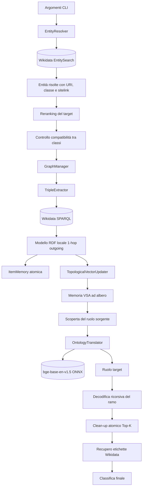
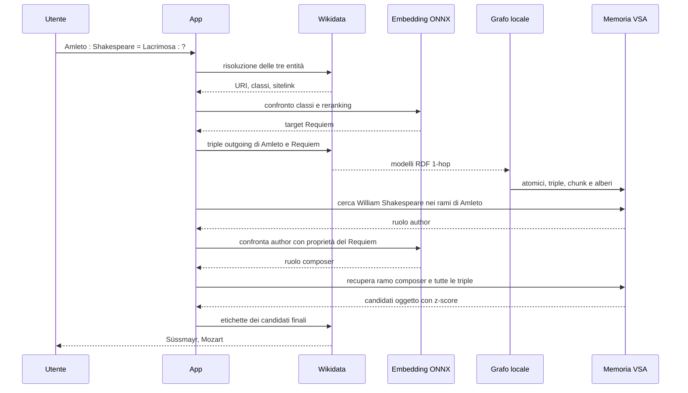

# Flusso dei dati e processo di ragionamento

## 1. Scopo del sistema

Neuro-Semantic Investigator risolve analogie della forma:

```text
A : B = C : ?
```

Il processo combina tre componenti:

1. Wikidata fornisce entità, tipi, proprietà e triple RDF.
2. La Vector Symbolic Architecture rappresenta struttura e relazioni mediante binary spatter codes.
3. Il modello ONNX `bge-base-en-v1.5` confronta etichette e tipi appartenenti a domini diversi.

Nell'esempio predefinito:

```text
Amleto : William Shakespeare = Lacrimosa : ?
```

la VSA individua `author` nel dominio sorgente, l'embedding traduce il ruolo in `composer` e la VSA recupera gli oggetti collegati a Lacrimosa tramite quel ruolo.

## 2. Vista generale



## 3. Dati in ingresso

`App` accetta cinque opzioni:

| Opzione | Significato | Default |
|---|---|---|
| `--source` | entità A | `Amleto` |
| `--known` | entità B | `William Shakespeare` |
| `--target` | entità C | `Lacrimosa` |
| `--candidates` | candidati Wikidata considerati per C | `5` |
| `--top` | risultati finali mostrati | `3` |

Le stringhe non vengono ancora trasformate direttamente in vettori. Prima sono risolte in entità Wikidata.

## 4. Risoluzione e disambiguazione delle entità

### 4.1 Ricerca su Wikidata

`EntityResolver` interroga `EntitySearch` e restituisce per ogni candidato:

- URI dell'entità;
- etichetta inglese;
- URI e nome della classe `instance of`;
- numero di sitelink.

La sorgente e l'oggetto noto usano il primo risultato. Per il target vengono richiesti più candidati.

### 4.2 Reranking del target

`OntologyTranslator.disambiguateCandidates` confronta la classe della sorgente con la classe di ogni candidato target. Il punteggio è:

```text
score = 0,60 × similarità_embedding_classi
      + 0,40 × sitelink_normalizzati
```

Viene scelto il candidato con punteggio massimo. Nell'esempio, `Lacrimosa` viene disambiguata come il movimento del Requiem.

### 4.3 Controllo di compatibilità

Le etichette delle classi sorgente e target vengono codificate dal modello ONNX. Se la similarità coseno è almeno `0,35`, il processo continua con il target scelto.

Se la similarità è inferiore, `App` cerca su Wikidata eventi o nodi collegati al target e seleziona mediante embedding quello più vicino alla classe sorgente.

## 5. Ingestione del grafo RDF

`InvestigationEngine.expandAndProcess` viene chiamato per la sorgente e per il target.

Il flusso effettivo è:

```text
URI dell'entità
    ↓
TripleExtractor.extractBidirectional(...)
    ↓
query CONSTRUCT 1-hop outgoing
    ↓
GraphManager.localModel
    ↓
generazione degli atomici e costruzione degli alberi VSA
```

Nonostante il nome `extractBidirectional`, la query corrente acquisisce solamente triple in uscita:

```text
<entità> ?predicato ?oggetto
```

Il modello Jena locale accumula le triple scaricate per entrambe le entità.

## 6. Rappresentazione VSA

### 6.1 Vettori atomici

Ogni URI o valore letterale viene trasformato in un binary spatter code bipolare:

```text
v(u) ∈ {-1, +1}^10000
```

`RandomGenerationStrategy` deriva il seed dall'URI. Lo stesso valore produce quindi lo stesso vettore in esecuzioni differenti.

`ItemMemory` conserva tre livelli:

| Livello | Contenuto |
|---|---|
| `atomicMemory` | entità, predicati, letterali e ruoli interni |
| `chunkMemory` | rami e sotto-chunk puri |
| `treeMemory` | radice finale associata a ogni entità |

### 6.2 Operazioni

| Operazione | Implementazione | Uso |
|---|---|---|
| binding `⊗` | prodotto elemento per elemento | associa soggetto, ruolo e oggetto |
| bundling `Σ` | somma e soglia bipolare | sovrappone più elementi |
| permutazione `ρ(v,k)` | rotazione circolare di `k` posizioni | codifica ordine e funzione |
| similarità | prodotto scalare normalizzato | misura la vicinanza tra vettori |

Il binding bipolare è auto-inverso:

```text
(A ⊗ B) ⊗ B = A
```

## 7. Codifica delle triple

Ogni tripla RDF `(s,p,o)` viene codificata come:

```text
T(s,p,o) = S ⊗ ρ(P,1) ⊗ ρ(O,2)
```

Questa forma consente di recuperare l'oggetto da una tripla purificata:

```text
O = ρ⁻¹(T ⊗ S ⊗ ρ(P,1), 2)
```

## 8. Costruzione di un chunk secondo Simpkin

Per un contenuto ordinato `Z₁ ... Zₙ`, `encodeChunk` applica l'equazione 5 di Simpkin et al.:

```text
C = Σᵢ [ρ(Zᵢ,i) ⊗ (p₀ ⊗ ... ⊗ pᵢ₋₁)]
  + StopVec ⊗ (p₀ ⊗ ... ⊗ pₙ)
```

Nel codice gli indici Java partono da zero, quindi l'elemento `i` usa uno shift `i + 1` e il prodotto cumulativo dei role vector da `position:0` a `position:i`.

`StopVec` delimita la parte utile. Quando il numero dei termini è pari, viene aggiunto un vettore di riempimento deterministico per evitare pareggi nel bundling bipolare.

Con capacità predefinita 30, ogni chunk contiene al massimo:

```text
29 elementi + StopVec
```

## 9. Albero dei valori di un predicato

Le triple vengono prima raggruppate per predicato. Se un predicato possiede al massimo 29 oggetti, il suo ramo contiene un solo chunk di triple.

Con 100 oggetti la partizione è:

```text
radice del ramo
├── chunk 0: triple  0–28   (29)
├── chunk 1: triple 29–57   (29)
├── chunk 2: triple 58–86   (29)
└── chunk 3: triple 87–99   (13)
```

Ogni `ValueNode` conserva:

- il vettore puro del nodo;
- i figli;
- il numero complessivo di foglie discendenti.

Se anche il livello dei sotto-chunk supera la capacità, lo stesso procedimento viene ripetuto. La profondità non è codificata nell'applicazione: deriva dall'albero costruito.

## 10. Albero dei rami di un'entità

Per ogni predicato `p` viene costruito un ramo dei valori `Bₚ`. La foglia di ramo è:

```text
Rₚ = Bₚ ⊗ P
```

### 10.1 Entità con meno di 30 predicati

I rami entrano direttamente nella radice dell'entità. Il predicato è già legato nella foglia e non viene applicato una seconda volta.

```text
radice entità
├── ρ(Bₚ₁ ⊗ P₁, 100)
├── ρ(Bₚ₂ ⊗ P₂, 100)
└── vettore atomico dell'entità
```

### 10.2 Fat node con almeno 30 predicati

I rami vengono partizionati ricorsivamente in gruppi da 29. Per 100 predicati il primo livello contiene gruppi da:

```text
29 + 29 + 29 + 13
```

Ogni gruppo viene codificato come chunk e trattato come nodo del livello superiore. `BranchPath` conserva il ruolo della radice e la sequenza di posizioni necessaria per raggiungere ciascun predicato.

Questa gerarchia impedisce che una radice contenga 100 segnali sovrapposti e perda ogni ramo nel rumore.

## 11. Decodifica ricorsiva e clean-up strutturale

Per estrarre la posizione `k` da un chunk:

```text
decode(C,k) = ρ⁻¹(C ⊗ (p₀ ⊗ ... ⊗ pₖ), k+1)
```

`recoverBranch` percorre l'albero dei rami fino al predicato richiesto. `recoverTriple` e `recoverTriples` percorrono poi l'albero dei valori.

A ogni passaggio:

1. viene decodificata la posizione del figlio;
2. il risultato rumoroso viene confrontato con il figlio atteso;
3. se la similarità supera `3/√D`, il risultato viene sostituito con il vettore puro del figlio;
4. la discesa continua dal vettore purificato.

Per `D=10000` la soglia strutturale è:

```text
3/√10000 = 0,03
```

Lo z-score strutturale mostrato dalla demo è:

```text
z = similarità × √D
```

## 12. Scoperta del ruolo sorgente

Per ogni proprietà non classificata come metadato:

1. viene recuperato il ramo;
2. vengono recuperate ricorsivamente tutte le triple;
3. da ogni tripla viene svincolato l'oggetto;
4. l'oggetto rumoroso viene confrontato con il vettore dell'entità nota B.

Le similarità osservate formano una distribuzione con media `μ` e deviazione standard `σ`. Il sistema seleziona il ruolo col maggiore z-score sopra la soglia empirica:

```text
z = (similarità - μ) / σ

soglia = 3,0 + 0,5 × log₁₀(numero_ipotesi)
```

Nella demo il ruolo sorgente risultante è `author`.

## 13. Traduzione del ruolo tra domini

Il sistema raccoglie le proprietà del target e mantiene quelle che puntano a entità Wikidata. Le etichette vengono recuperate in batch.

`OntologyTranslator` codifica:

- l'etichetta del ruolo sorgente;
- l'etichetta di ogni proprietà candidata del target.

Viene scelta la proprietà con similarità coseno massima, purché raggiunga `0,60`. Nella demo:

```text
author → composer
```

Questa fase usa il modello ONNX. La VSA continua invece a usare vettori bipolari deterministici.

## 14. Recupero e ranking dell'oggetto finale

Una volta noto il ruolo target:

1. `recoverBranch` recupera il ramo puro del target;
2. `recoverTriples` attraversa l'intero albero dei valori;
3. soggetto e predicato vengono svincolati da ogni tripla;
4. `ItemMemory.cleanUpRelativeTopK` confronta il risultato con la memoria atomica;
5. per ogni URI viene mantenuto il punteggio migliore;
6. i risultati vengono ordinati per z-score;
7. Wikidata fornisce le etichette finali in una query batch.

Il risultato della demo corrente è:

```text
#1 Franz Xaver Süssmayr      σ = 30,86
#2 Wolfgang Amadeus Mozart  σ = 30,85
```

## 15. Dipendenze esterne e punti di errore

| Fase | Dipendenza | Possibile esito |
|---|---|---|
| risoluzione | Wikidata EntitySearch | nessuna entità trovata |
| ingestione | Wikidata SPARQL | modello RDF incompleto |
| embedding | `models/model.onnx` e `tokenizer.json` | inizializzazione fallita |
| compatibilità | soglia `0,35` | ricerca di un target compensativo |
| traduzione ruolo | soglia `0,60` | nessun ruolo target accettato |
| ramo VSA | soglia strutturale 3σ | ramo rifiutato |
| clean-up finale | memoria atomica e soglia dinamica | nessun candidato finale |

Il progetto non persiste la memoria tra esecuzioni. Grafo, vettori atomici, chunk, percorsi e radici vengono ricostruiti a ogni avvio.

## 16. Sequenza completa della demo


