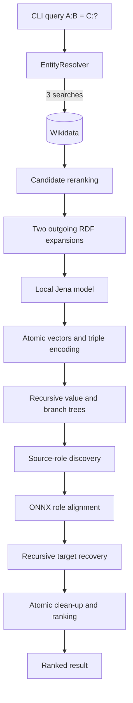

# Neuro-Semantic Investigator

> A research prototype for structural analogies over Wikidata using
> Vector Symbolic Architectures and local sentence embeddings.

[]()
[]()
[]()
[]()

---

## What this project does

Neuro-Semantic Investigator evaluates analogies of the form:

```text
A : B = C : ?
```

It resolves the three input names against Wikidata, downloads bounded
one-hop RDF neighborhoods, encodes their triples in 10,000-dimensional
binary spatter codes, discovers the relation between `A` and `B`, maps
that relation to the domain of `C` with a local ONNX embedding model,
and ranks the objects recovered from the corresponding target branch.

For the default query:

```text
Amleto : William Shakespeare = Lacrimosa : ?
```

the current pipeline discovers `author`, maps it to `composer`, and
returns Franz Xaver Süssmayr and Wolfgang Amadeus Mozart. The console
output exposes the resolved entities, selected roles, embedding scores,
VSA branch confidence, and final candidate scores.

This repository is an experimental implementation. Its scores are
relative separation measures inside the current associative memory;
they are not calibrated probabilities.

---

## Why combine RDF, VSA, and embeddings?

Each component has a narrow role:

- **Wikidata and RDF** provide the entities and explicit graph
  structure used by the inference.
- **VSA algebra** represents triples, predicates, positions, chunks,
  and tree levels through deterministic bind, bundle, and permutation
  operations.
- **Sentence embeddings** compare labels belonging to different
  ontologies, such as `author` and `composer`. The embedding model does
  not generate the final answer.

This separation makes it possible to inspect how a result was obtained:
which Wikidata entities were selected, which source predicate was found,
which target predicate was chosen, and which objects were recovered from
that predicate. Some stages still use empirical thresholds and external
Wikidata data, so reproducibility also depends on those inputs.

---

## VSA model and hierarchical chunking

This project is inspired by Vector Symbolic Architectures (VSA) and by
the hierarchical chunking scheme proposed by Simpkin et al. (2018) for
encoding large-scale, structurally recursive representations.

Atomic symbols are deterministic bipolar vectors:

```text
v(u) ∈ {-1,+1}^10000
```

The implementation uses:

- **binding** by element-wise multiplication;
- **bundling** by simultaneous addition followed by bipolar thresholding;
- **permutation** by circular shift;
- **cosine similarity** for comparison and clean-up.

An RDF triple is encoded as:

```text
T(s,p,o) = S ⊗ ρ(P,1) ⊗ ρ(O,2)
```

Chunks follow the cumulative positional scheme from equation 5 of
Simpkin et al. Each element is shifted by its position and bound to the
cumulative product of positional role vectors. A `StopVec` terminates
the content.

The chunk capacity is configurable and defaults to 30, leaving room for
29 data elements plus `StopVec`. If a predicate has more than 29
objects, its triples form a recursive value tree. If an entity has at
least 30 predicates, its predicate branches form a separate recursive
branch tree. Both trees are traversed and cleaned one level at a time.

The implementation is an adaptation of the paper to RDF data. Fixed
permutations distinguish predicate and object roles inside a triple;
cumulative positional roles encode order inside each chunk.

---

## Processing pipeline



The main stages are:

1. resolve the three names and rerank target candidates;
2. download outgoing one-hop RDF neighborhoods for source and target;
3. generate deterministic atomics and encode RDF triples;
4. build recursive value trees and predicate-branch trees;
5. recover the predicate relating source and known object;
6. align that predicate with target predicates using local embeddings;
7. traverse the target tree and rank recovered objects;
8. fetch display labels in batches.

The ordinary path currently performs about nine remote requests in
sequence. Property and final-result labels are batched, but the remaining
request waterfall makes runtime sensitive to Wikidata latency.

Detailed internals are documented in [FLUSSO_DATI.md](FLUSSO_DATI.md).
Completed work and remaining defects are tracked in
[STATO_LAVORI.md](STATO_LAVORI.md).

---

## Stack

| Layer | Technology |
|---|---|
| Language | Java 21 |
| Build | Maven |
| Knowledge source | Wikidata (SPARQL endpoint) |
| RDF toolkit | Apache Jena 5.0 (jena-core, jena-arq) |
| Embeddings | LangChain4j 0.27 + ONNX Runtime |
| Encoder model | `bge-base-en-v1.5` (768-D, quantized ONNX) |
| Logging | SLF4J + Logback |
| Testing | JUnit 5 |

---

## Setup

### Prerequisites

- JDK 21
- Maven 3.9+
- Network access to `https://query.wikidata.org/sparql`

### Model download

The ONNX encoder (`bge-base-en-v1.5`, 768-D, quantized, ~110 MB) is not
shipped in the repository. Download the two files from Hugging Face:

- [model_quantized.onnx](https://huggingface.co/Xenova/bge-base-en-v1.5/resolve/main/onnx/model_quantized.onnx)
- [tokenizer.json](https://huggingface.co/Xenova/bge-base-en-v1.5/resolve/main/tokenizer.json)

Place them under `models/` and rename the model file to `model.onnx`:

```
models/
├── model.onnx          (renamed from model_quantized.onnx)
└── tokenizer.json
```

### Build and run

```bash
git clone https://github.com/ant-ctrl-win/neuro-semantic-investigator.git
cd neuro-semantic-investigator
mvn clean compile
mvn test
```

Run the demo (`App.main` from your IDE or via classpath). The default
query is `Amleto : William Shakespeare = Lacrimosa : ?`.

---

## Usage

### Command-line interface

The engine accepts query parameters at runtime. No code editing required.

**Note on shell syntax**: PowerShell and Bash handle Maven's `-Dexec.args`
differently. Use the syntax that matches your shell.

**Bash / macOS / Linux**:
```bash
# Default query (Amleto : William Shakespeare = Lacrimosa : ?)
mvn exec:java

# Custom query
mvn exec:java -Dexec.args="--source Nile --known Egypt --target Danube"

# With options
mvn exec:java -Dexec.args="--source 'Nile' --known 'Egypt' --target 'Mont Blanc' --top 5 --candidates 10"

# Help
mvn exec:java -Dexec.args="--help"
```

**Windows PowerShell**:
```powershell
# Default query (Amleto : William Shakespeare = Lacrimosa : ?)
mvn exec:java

# Custom query (note: only one set of double quotes, wrapping the whole -D)
mvn exec:java "-Dexec.args=--source Nile --known Egypt --target Danube"

# With options (PowerShell does not need inner quotes for single-word args)
mvn exec:java "-Dexec.args=--source Nile --known Egypt --target 'Mont Blanc' --top 5"

# Help
mvn exec:java "-Dexec.args=--help"
```

**Alternative (PowerShell, disables argument parsing)**:
```powershell
mvn exec:java --% -Dexec.args="--source Nile --known Egypt --target Danube"
```

### Options

| Flag | Default | Description |
|---|---|---|
| `--source` | `Amleto` | Source entity (the `A` in `A : B = C : ?`) |
| `--known` | `William Shakespeare` | Known entity (the `B`) |
| `--target` | `Lacrimosa` | Target entity (the `C`) |
| `--candidates` | `5` | Number of Wikidata candidates to consider when disambiguating the target |
| `--top` | `3` | Number of top-scored results to display |
| `--help`, `-h` | — | Show usage and exit |

### Example session

```
$ mvn exec:java -Dexec.args="--source Nile --known Egypt --target Danube"

[*] Query: Nile : Egypt = Danube : ?
[*] Target candidates: 5, top-K: 3

[!] ANALOGIA RISOLTA CON SUCCESSO:
    Egypt           sta a  Nile
    COME

    #1  Switzerland               sta a  Danube             (σ = 18.01)
    #2  Serbia                    sta a  Danube             (σ = 17.43)

    [Logica Applicata]: basin country ===> basin country
```

### Programmatic use

The engine is also usable as a Java library. See `App.java` for the
pipeline entry point, and `InvestigationEngine` for the core inference
API.


## Examples

### Example 1 — Literary analogy across domains

**Query:** `Amleto : William Shakespeare = Lacrimosa : ?`

```
[!] ANALOGIA RISOLTA CON SUCCESSO:
    William Shakespeare sta a  Hamlet
    COME

    #1  Franz Xaver Süssmayr      sta a  Requiem            (σ = 30.86)
    #2  Wolfgang Amadeus Mozart   sta a  Requiem            (σ = 30.85)

    [Logica Applicata]: author ===> composer
```

The engine identified *author* (of a dramatic work) as structurally
analogous to *composer* (of a musical work), then retrieved two
candidates: Mozart (original composer) and Süssmayr (who completed the
work posthumously). Both are correct in different senses — the system
exposes the ambiguity rather than hiding it.

### Example 2 — Geographical analogy, cross-ontology

**Query:** `Nile : Egypt = Mont Blanc : ?`

```
    #1  France                    sta a  Mont Blanc         (σ = 34.00)
    #2  Italy                     sta a  Mont Blanc         (σ = 33.85)

    [Logica Applicata]: country ===> country
```

The current Wikidata neighborhood links the Nile and Mont Blanc through
the `country` predicate. The engine discovers that predicate from the
known source object and retrieves both countries attached to Mont Blanc.

### Example 3 — Analogy across radically different domains

**Query:** `Nile : Egypt = spaghetti : ?`

```
    #1  Italy                     sta a  spaghetti          (σ = 29.25)

    [Logica Applicata]: basin country ===> country
```

An hydrological feature and a type of pasta share an abstract structure:
both are *associated with a country*. This is the class of inference
that rule-based systems cannot express and pure LLMs cannot justify.

---

## Current limitations

### Sequential network waterfall

The normal path performs approximately nine sequential Wikidata
requests: three entity searches, two graph expansions, two individual
role-label lookups, and two batch-label requests. This is a fixed
waterfall rather than a query per RDF property, but its latency is still
the sum of all remote calls.

### One-hop outgoing graph only

The extractor downloads direct outgoing triples. The existing
`extractBidirectional` name and `Direction` API do not yet reflect the
actual behavior. Multi-hop and incoming-edge inference are unsupported.

### Heuristic thresholds

Class compatibility, role alignment, source-role selection, structural
clean-up, and final atomic clean-up use empirical or distribution-based
thresholds. The printed σ values indicate separation in the current
candidate memory and must not be interpreted as probabilities.

### Final clean-up candidate domain

The final atomic clean-up currently searches the entire atomic memory,
which also contains predicates and internal role vectors. Restricting
the candidate bank to objects of the selected target predicate is a
planned correctness improvement.

### Partial recursive recovery

`recoverTriples` currently omits a leaf that fails structural clean-up.
The API does not yet expose whether the returned list is complete.

### In-memory state

The Jena graph, atomic vectors, chunk vectors, tree paths, and roots are
rebuilt on every run. There is no persistence or cross-run cache.

### External data and model requirements

Results depend on live Wikidata content and availability. Semantic role
alignment requires the local ONNX model and tokenizer. Console output is
currently in Italian.

---

## Next engineering steps

The immediate work is intentionally narrower than a product roadmap:

1. add a combined regression test with at least 30 predicates and one
   predicate containing 100 objects;
2. remove the duplicate branch traversal between `recoverBranch` and
   `recoverTriples`;
3. restrict final candidates to objects of the selected target role;
4. make recursive recovery report incomplete results explicitly;
5. parallelize independent Wikidata requests and add per-stage timing;
6. remove unused test frameworks and the dynamic TestNG version;
7. validate CLI input before initializing ONNX;
8. remove obsolete chunks when rebuilding a node;
9. align graph-extraction names with outgoing-only behavior or implement
   incoming extraction.

See [STATO_LAVORI.md](STATO_LAVORI.md) for the evidence and detailed
order of intervention.

---

## References

- Simpkin, C., Taylor, I., Bent, G. A., de Mel, G., & Ganti, R. K.
  (2018). *Scaling Up Vector Symbolic Architectures via Hierarchical
  Chunking for Decentralized Workflows.* IEEE International Conference
  on Semantic Computing (ICSC). — *Foundational reference for the
  hierarchical chunking scheme implemented in this project.*
- Kanerva, P. (2009). *Hyperdimensional Computing: An Introduction to
  Computing in Distributed Representation with High-Dimensional Random
  Vectors.* Cognitive Computation, 1(2), 139–159.
- Neubert, P., Schubert, S., & Protzel, P. (2019). *An Introduction to
  Hyperdimensional Computing for Robotics.* Chemnitz University of
  Technology.
- Karunaratne, G. et al. (2021). *Robust High-dimensional Memory-augmented
  Neural Networks.* IBM Research – Zurich.

---

## Origin

This project was born during a research internship at **VAIMEE**, a
University of Bologna spin-off working on Semantic Web technologies,
where it opened a new internal R&D line on neuro-symbolic retrieval.

---

## License

Apache License 2.0 — see [LICENSE](LICENSE).
