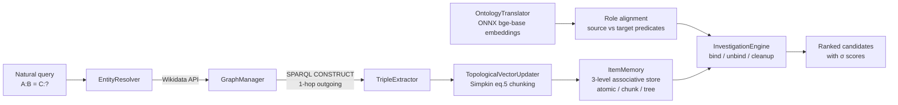

# Neuro-Semantic Investigator

> Explainable analogical reasoning over Wikidata using Vector Symbolic Architectures.
> No black box. Every inference is traceable.

[]()
[]()
[]()
[]()

---

## Elevator Pitch

Large Language Models reason fluently but opaquely. Ask an LLM whether
*Hamlet : Shakespeare = Requiem : ?* and you may get the right answer —
with no auditable path to it. In regulated environments (legal, pharma,
industrial compliance) that is not acceptable.

**Neuro-Semantic Investigator** answers structural analogies over Wikidata
without training a single parameter. It builds a high-dimensional
associative memory from RDF triples using **Vector Symbolic Architectures
(VSA)**, performs inference through bind / bundle / permute algebra, and
returns a ranked list of candidates with statistical confidence scores.

**Explainable AI by construction**, not by post-hoc explanation.

---

## Why it matters

- **Cross-domain analogies.** Traditional SPARQL queries require the
  relation to be expressible in the query. NSI finds structural
  analogies across domains that no rigid rule-based system would
  surface. Example: *Nile : Egypt = Mont Blanc : ?* returns France and
  Italy — linking a geographical feature (*basin country*) to a
  political one (*country*).
- **No training.** The engine adds new knowledge by vector operations,
  not by gradient descent. No GPU, no retraining, no model drift.
- **Regulated industries** need inference chains auditors can follow.
- **Edge AI** benefits from associative memories that fit in kilobytes
  and need no accelerator at inference time.

---

## Theoretical Foundation

This project is inspired by Vector Symbolic Architectures (VSA) and by
the hierarchical chunking scheme proposed by Simpkin et al. (2018) for
encoding large-scale, structurally recursive representations.

VSA encodes atomic symbols as high-dimensional random vectors (10,000
dimensions for binary spatter codes) and combines them through two
operations:

- **Bundling** — element-wise addition, produces a vector similar to all
  its components (a "bag of features").
- **Binding** — element-wise multiplication or XOR, produces a vector
  dissimilar to both operands (a "role-filler pair").

Simpkin et al. observed that bundling has a **theoretical capacity limit
of ~89 vectors** for 10,000-dimensional binary spaces (at 3σ confidence),
and proposed recursive chunking to overcome it: when a bundle would
exceed capacity, group elements into sub-chunks, encode each sub-chunk
as a single hypervector, and bundle the sub-chunks instead — producing a
hierarchical tree with semantic matching at every level.

NSI adapts this scheme to a different domain: instead of encoding
workflows, it encodes RDF triples from Wikidata as bound role-filler
pairs, bundles them into chunk and tree memories, and performs
analogical inference through unbinding and statistical clean-up.

**Important**: the current implementation is a **pragmatic adaptation**
of the Simpkin scheme, not a faithful implementation. Specifically:

- Permutations use **fixed shifts** for the triple roles (S/P/O at
  1, 2) plus a cumulative positional encoding (eq. 5) at the chunk level.
- The StopVec is included in the bundle with cumulative positional
  roles, following eq. 5.
- The chunk size is configurable (default 30, conservative vs. the
  theoretical 89 at 3σ).
- Recursive chunking is applied both to triples within a predicate
  bucket and to branches within a node, with content-addressed padding.

---

## Architecture



**Data flow**

1. **Entity resolution** — query keywords are mapped to Wikidata entities.
2. **Subgraph extraction** — a bounded 1-hop neighborhood is downloaded
   via SPARQL CONSTRUCT.
3. **Chunking** — RDF triples are grouped by predicate and encoded as
   role-filler pairs, then bundled with cumulative positional roles
   (Simpkin eq. 5). Nodes with many predicates are recursively chunked.
4. **Ontology alignment** — predicates are embedded with an ONNX
   sentence encoder and semantically matched across domains (e.g.
   *author* → *composer*, *basin country* → *country*).
5. **Inference** — the engine binds, unbinds, and statistically cleans
   up hypervectors to retrieve the entity that satisfies `A : B = C : x`.
6. **Output** — ranked candidates with σ confidence scores, plus the
   applied analogy for full traceability.

---

## Stack

| Layer | Technology |
|---|---|
| Language | Java 21 |
| Build | Maven |
| Knowledge source | Wikidata (SPARQL endpoint) |
| RDF toolkit | Apache Jena 5.0 (jena-core, jena-arq) |
| Embeddings | LangChain4j 0.27 + ONNX Runtime |
| Encoder model | `bge-base-en-v1.5` (768-D, quantized ONNX) |
| Logging | SLF4J + Logback |
| Testing | JUnit 5 |

---

## Setup

### Prerequisites

- JDK 21
- Maven 3.9+
- Network access to `https://query.wikidata.org/sparql`

### Model download

The ONNX encoder (`bge-base-en-v1.5`, 768-D, quantized, ~110 MB) is not
shipped in the repository. Download the two files from Hugging Face:

- [model_quantized.onnx](https://huggingface.co/Xenova/bge-base-en-v1.5/resolve/main/onnx/model_quantized.onnx)
- [tokenizer.json](https://huggingface.co/Xenova/bge-base-en-v1.5/resolve/main/tokenizer.json)

Place them under `models/` and rename the model file to `model.onnx`:

```
models/
├── model.onnx          (renamed from model_quantized.onnx)
└── tokenizer.json
```

### Build and run

```bash
git clone https://github.com/ant-ctrl-win/neuro-semantic-investigator.git
cd neuro-semantic-investigator
mvn clean compile
mvn test
```

Run the demo (`App.main` from your IDE or via classpath). The default
query is `Amleto : William Shakespeare = Lacrimosa : ?`.

---

## Usage

### Command-line interface

The engine accepts query parameters at runtime. No code editing required.

**Note on shell syntax**: PowerShell and Bash handle Maven's `-Dexec.args`
differently. Use the syntax that matches your shell.

**Bash / macOS / Linux**:
```bash
# Default query (Amleto : William Shakespeare = Lacrimosa : ?)
mvn exec:java

# Custom query
mvn exec:java -Dexec.args="--source Nile --known Egypt --target Danube"

# With options
mvn exec:java -Dexec.args="--source 'Nile' --known 'Egypt' --target 'Mont Blanc' --top 5 --candidates 10"

# Help
mvn exec:java -Dexec.args="--help"
```

**Windows PowerShell**:
```powershell
# Default query (Amleto : William Shakespeare = Lacrimosa : ?)
mvn exec:java

# Custom query (note: only one set of double quotes, wrapping the whole -D)
mvn exec:java "-Dexec.args=--source Nile --known Egypt --target Danube"

# With options (PowerShell does not need inner quotes for single-word args)
mvn exec:java "-Dexec.args=--source Nile --known Egypt --target 'Mont Blanc' --top 5"

# Help
mvn exec:java "-Dexec.args=--help"
```

**Alternative (PowerShell, disables argument parsing)**:
```powershell
mvn exec:java --% -Dexec.args="--source Nile --known Egypt --target Danube"
```

### Options

| Flag | Default | Description |
|---|---|---|
| `--source` | `Amleto` | Source entity (the `A` in `A : B = C : ?`) |
| `--known` | `William Shakespeare` | Known entity (the `B`) |
| `--target` | `Lacrimosa` | Target entity (the `C`) |
| `--candidates` | `5` | Number of Wikidata candidates to consider when disambiguating the target |
| `--top` | `3` | Number of top-scored results to display |
| `--help`, `-h` | — | Show usage and exit |

### Example session

```
$ mvn exec:java -Dexec.args="--source Nile --known Egypt --target Danube"

[*] Query: Nile : Egypt = Danube : ?
[*] Target candidates: 5, top-K: 3

[!] ANALOGIA RISOLTA CON SUCCESSO:
    Egypt           sta a  Nile
    COME

    #1  Switzerland               sta a  Danube             (σ = 18.01)
    #2  Serbia                    sta a  Danube             (σ = 17.43)

    [Logica Applicata]: basin country ===> basin country
```

### Programmatic use

The engine is also usable as a Java library. See `App.java` for the
pipeline entry point, and `InvestigationEngine` for the core inference
API.


## Examples

### Example 1 — Literary analogy across domains

**Query:** `Amleto : William Shakespeare = Lacrimosa : ?`

```
[!] ANALOGIA RISOLTA CON SUCCESSO:
    William Shakespeare sta a  Hamlet
    COME

    #1  Franz Xaver Süssmayr      sta a  Requiem            (σ = 27.54)
    #2  Wolfgang Amadeus Mozart   sta a  Requiem            (σ = 27.44)

    [Logica Applicata]: author ===> composer
```

The engine identified *author* (of a dramatic work) as structurally
analogous to *composer* (of a musical work), then retrieved two
candidates: Mozart (original composer) and Süssmayr (who completed the
work posthumously). Both are correct in different senses — the system
exposes the ambiguity rather than hiding it.

### Example 2 — Geographical analogy, cross-ontology

**Query:** `Nile : Egypt = Mont Blanc : ?`

```
    #1  France                    sta a  Mont Blanc         (σ = 30.54)
    #2  Italy                     sta a  Mont Blanc         (σ = 30.49)

    [Logica Applicata]: basin country ===> country
```

The engine mapped *basin country* (a hydrological property) to *country*
(a political property). No SPARQL query expresses this relation; the
system found it structurally.

### Example 3 — Analogy across radically different domains

**Query:** `Nile : Egypt = spaghetti : ?`

```
    #1  Italy                     sta a  spaghetti          (σ = 29.25)

    [Logica Applicata]: basin country ===> country
```

An hydrological feature and a type of pasta share an abstract structure:
both are *associated with a country*. This is the class of inference
that rule-based systems cannot express and pure LLMs cannot justify.

---

## Known Limitations

### Multi-hop inference not supported

The engine operates on direct 1-hop neighborhoods. Deductions requiring
traversing two or more hops (e.g., *Nile → country → continent*) are
outside the current scope.

### Disambiguation depends on popularity prior

Entity disambiguation combines class similarity (60%) and Wikidata
sitelink count (40%). Sitelink count introduces three biases:
- **Popularity bias** — mainstream entities win over contextually
  correct obscure ones.
- **Cultural bias** — Western/anglophone entities accumulate more
  sitelinks.
- **Recency bias** — recently created entities have fewer sitelinks.

Example: the query `Nile : boat = cave : ?` disambiguates *cave* to
*Minecraft* (a video game), not to the physical cave concept.

### Incoming edges not extracted

The current extractor fetches only outgoing triples. Properties listed
as "incoming" in the ontology inventory are not used for source-role
deduction. This is a conservative design choice that will be revisited.

### Demo output is in Italian

The console demo and inline comments are in Italian. The architecture
is language-agnostic; the README and code identifiers are in English.

### No persistence

`ItemMemory` is in-process only. Knowledge built during a run is not
saved between sessions.

---

## Roadmap

- **Incoming edge extraction** — bidirectional 1-hop for full
  neighborhood coverage.
- **Multi-hop inference** — recursive VSA decoding across graph
  traversal.
- **LLM front-end via LangChain4j** — natural-language questions
  converted to structured `A : B = C : ?` queries; the LLM handles
  phrasing, VSA handles reasoning. No hallucination surface.
- **REST API (Jakarta EE)** — expose the engine as a service.
- **Frontend (React)** — minimal query interface with ranked results
  and trace visualization.
- **ItemMemory persistence** — serialize associative memory between
  runs.

---

## References

- Simpkin, C., Taylor, I., Bent, G. A., de Mel, G., & Ganti, R. K.
  (2018). *Scaling Up Vector Symbolic Architectures via Hierarchical
  Chunking for Decentralized Workflows.* IEEE International Conference
  on Semantic Computing (ICSC). — *Foundational reference for the
  hierarchical chunking scheme implemented in this project.*
- Kanerva, P. (2009). *Hyperdimensional Computing: An Introduction to
  Computing in Distributed Representation with High-Dimensional Random
  Vectors.* Cognitive Computation, 1(2), 139–159.
- Neubert, P., Schubert, S., & Protzel, P. (2019). *An Introduction to
  Hyperdimensional Computing for Robotics.* Chemnitz University of
  Technology.
- Karunaratne, G. et al. (2021). *Robust High-dimensional Memory-augmented
  Neural Networks.* IBM Research – Zurich.

---

## Origin

This project was born during a research internship at **VAIMEE**, a
University of Bologna spin-off working on Semantic Web technologies,
where it opened a new internal R&D line on neuro-symbolic retrieval.

---

## License

Apache License 2.0 — see [LICENSE](LICENSE).